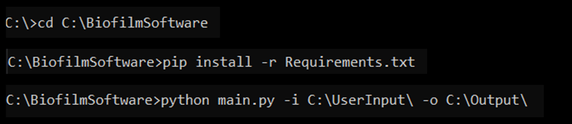
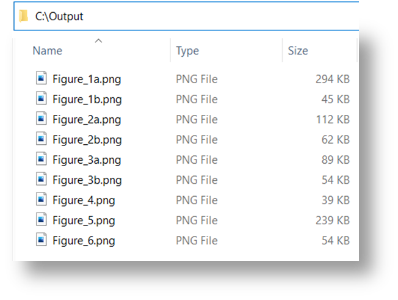

# Code to accompany the paper: ”An Open-Source Computational Tool for Measuring Bacterial Biofilm Morphology and Growth Kinetics upon One-Sided Exposure to an Anti-Microbial Source” #

Link to the paper: https://www.nature.com/articles/s41598-022-20275-8

## 1. Installation ##
Our program is compatible with Python 3 on Windows/Linux.
1. Install Python 3: https://www.python.org/download/releases/3.0/ 
2. Download freely available code from this repository.
3. Unzip the downloaded file. 
4. Rename the unzipped folder (optional): <CODE_FOLDER>, e.g., `“C:\BiofilmSoftware\”`
5. Open the command line (Windows command: cmd) 
6. Go to the folder: `cd C:\BiofilmSoftware\`
7. Run the following command (installation of necessary software components):
`pip install -r requirements.txt`

## 2. Execution ##
### 2.1 Input and Output folders preparation
Before executing the program, prepare an _input folder_ which will contain 
your biofilm images and an additional folder which will contain the 
center coordinates of the input images. For more detail, you can refer 
to the input folder that was used for our experiments (“Dataset”).

Additionally, create an _output folder_, into which all figures
generated by the software will be automatically saved. 
This step is optional, as the program will automatically 
create a folder in the destination specified in the execution 
command if it does not exist.

### 2.2 Execution command

`python main.py -i <INPUT_FOLDER> -o <OUTPUT_FOLDER>`

For example, if the input folder is `“C:\UserInput\”` and the output folder is `“C:\Output\”`,
the command is: 

`python main.py -i C:\UserInput\ -o C:\Output\`

### 2.3 Working example

The output folder will contain the resulting figures, numbered according to their references in the paper:

## Data 
The raw images are found in the "Dataset" folder.
Images are in ./Dataset/Images/
